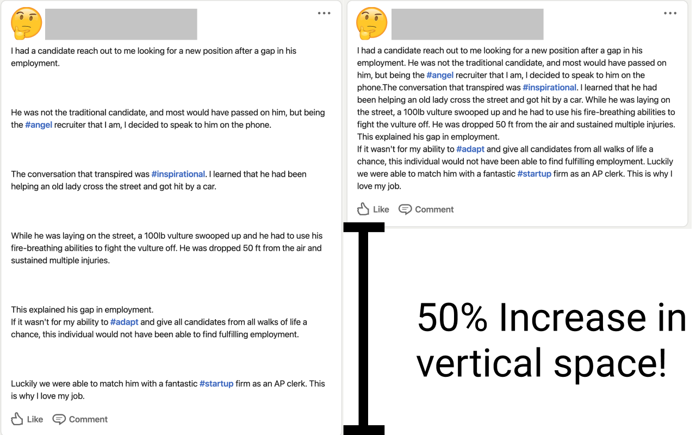

### 🤔 Tired of Linkedin double-spaced posts? 
### 💭 Wish they didn't take up so much space? 

LinkedInfluence Be Gone takes back your valuable browser viewport real estate by removing extra lines on Linkedin for you in every single post you see on your feed (See Screenshots for an example). It features a handy tracker to see how much text space you've taken back, complete with "thonk-leaders" you can unlock with every scroll! 

So now what can you do now that you've got so much more SPACE? Here are some of the ideas: 
- Invite friends over
- Get a pet (or 20 plants)
- Take up karate 
- Rent out the extra space for passive income

# Installation Instructions

### Step 1: Clone the repository to your computer or download the ZIP file
 - Click Code > Download .ZIP
 - Unzip the folder to a location you can refer to later

### 2. Open the Extension Management page by navigating to chrome://extensions.
- The Extension Management page can also be opened by clicking on the Chrome menu, hovering over More Tools then selecting Extensions.
- Enable Developer Mode by clicking the toggle switch next to Developer mode.
- Click the LOAD UNPACKED button and select the extension directory (the repository/folder location in step 1).
  

